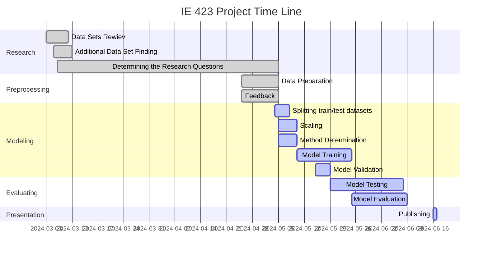

```mermaid
gantt  
       dateFormat  YYYY-MM-DD
       title IE 423 Project Time Line

       section Research
       Data Sets Rewiev                                   :done, des1, 2024-03-03,6d
       Additional Data Set Finding                        :done, des2, 2024-03-05,5d
       Determining the Research Questions                 :done, des3, 2024-03-06,2024-05-05

       section Preprocessing
       Data Preparation                                   :done, des4, 2024-04-25, 10d                             
       Feedback                                           :done, des5, 2024-04-25, 10d

       section Modeling
       Splitting train/test datasets                      :active, des8, 2024-05-04, 4d
       Scaling                                            :active, des9, 2024-05-05, 5d
       Method Determination                               :active, des10, 2024-05-05, 5d
       Model Training                                     :active, des11, 2024-05-10, 15d
       Model Validation                                   :active, des12, 2024-05-15, 4d

       section Evaluating
       Model Testing                                      :active, des13, 2024-05-19,20d
       Model Evaluation                                   :active, des14, 2024-05-25,15d

       section Presentation
       Publishing                                         :active, des17, 2024-06-16, 1d
    
```
